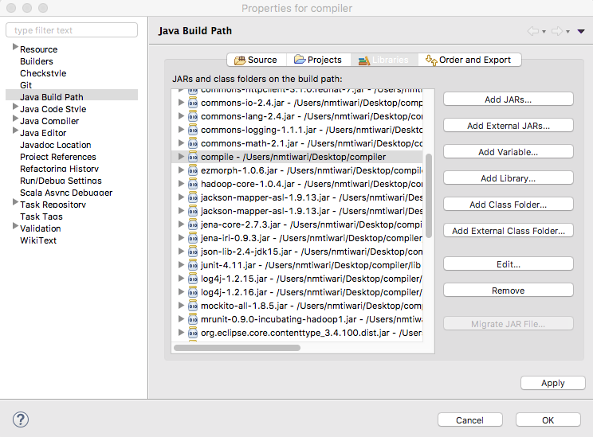
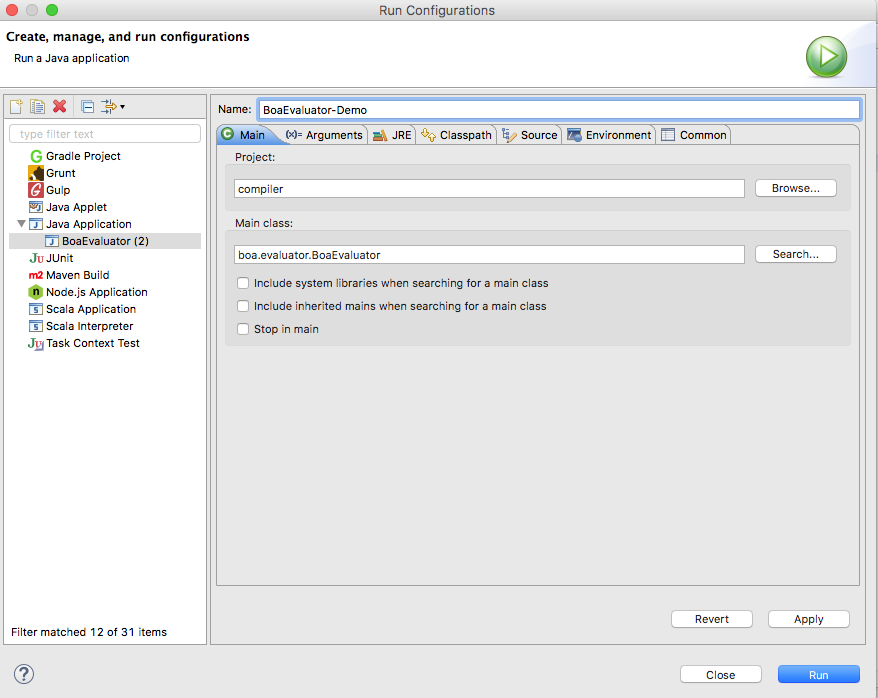
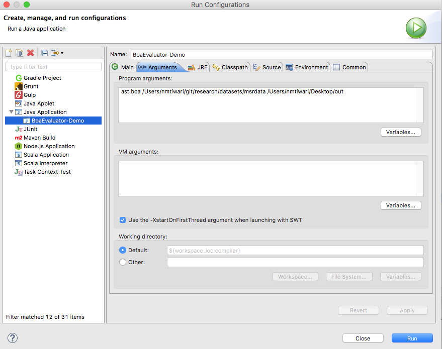
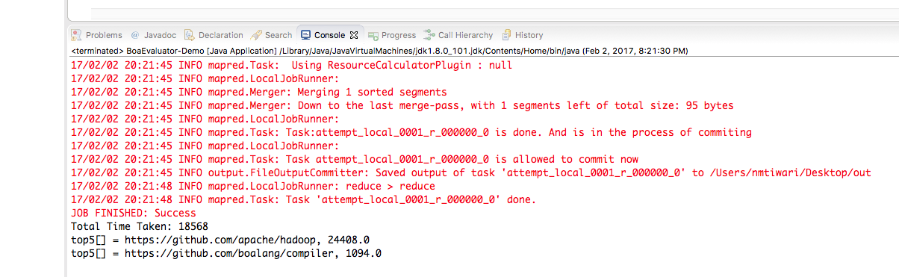
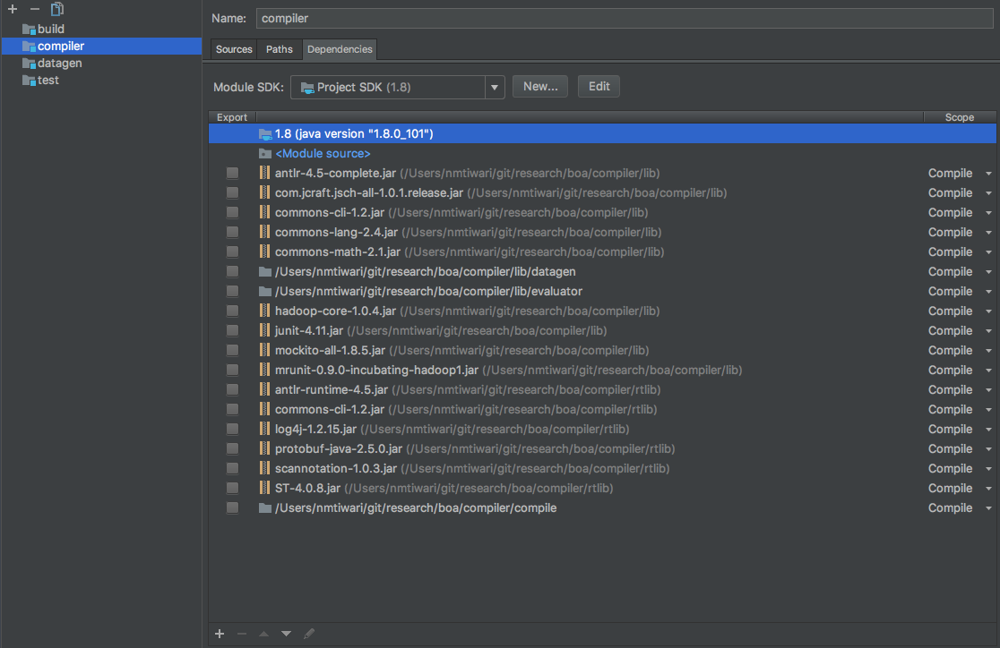
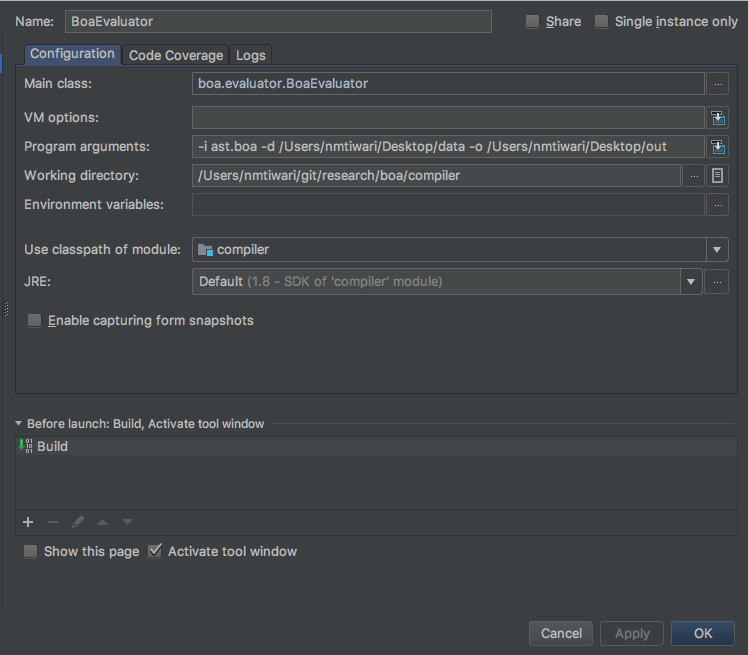
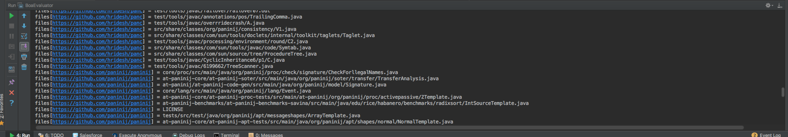

#Getting Started with Boa Development
This document describes how you might set up your development environment to view, edit and test
the Boa compiler's source code on your local computer. The Boa infrastructure hosted at 
http://boa.cs.iastate.edu uses the same code, but that execution would use a Hadoop cluster.

##Using Eclipse
1. Setup your development environment by following the instruction from 
[Development Setup page](doc/dev/setup.md).  
After following the instructions above, you would have successfully imported 
the project into your Eclipse IDE. You should also be able to trigger ant builds 
and edit project source files within your Eclipse installation. 

2. In order to run a Boa program locally, the Boa compiler compiles a Boa program 
to a Java program and runs the generated Java program using reflection and Hadoop 
libraries. To enable this within the Eclipse IDE  
    1. Create a directory named **"compile"** in the project's root directory.           
    2. From the project's "Properties > Java Build Path", select the "Libraries" tab."
    3. Use "Add External Class Folder" to add newly created directory (compile) in classpath. 
    4. After adding the "compile" directory, your "Libraries" tab should look like this:   
    6. From "Run > Run Configuration > Java Application" select "Main" tab to create a "Run Configuration" for the BoaEvaluator class.
       After this step your "Main" tab should look something like this: 
    7. Select "Arguments" tab in same window to provide program arguments separated by single space.  
       Program arguments include 
       1. **Path to Boa program**   
       2. **Path of the local dataset**  
       3. **Path of the output directory**.   
       Your "Arguments" tab should be look like: 
    8. Hit apply and Run, this will run your Boa program on local data.  Once the program execution
      completes, your "Console" will look similar to this: 
      Note that depending on your Boa program, the data set, and the capabilities of your local computer the 
      execution may take some time.
    9. Problems with the Boa compiler, and questions regarding Boa programming can be asked at 
      the [Boa user forum](http://boa.cs.iastate.edu/forum.php). 

###Using IntelliJ IDEA
1. Setup your development environment by following the instruction from 
[Development Setup page](doc/dev/setup.md).  
After following the instructions above, you would have successfully imported 
the project into your Eclipse IDE. You should also be able to trigger ant builds 
and edit project source files within your Eclipse installation. 

2. In order to run a Boa program locally, the Boa compiler compiles a Boa program 
to a Java program and runs the generated Java program using reflection and Hadoop 
libraries. To enable this within the IntelliJ IDE  
    1. Create a directory named **"compile"** in the project's root directory.           
    2. From the project's "Properties > Compiler", select the "Dependencies" tab."
    3. Use "+" (available at bottom) to add newly created directory (compile) in classpath. 
    4. After adding the "compile" directory, your "Dependencies" tab should look like this:   
    6. From "Run > Edit Configuration > Application" select "Configuration" tab to create a "Run Configuration" for the BoaEvaluator class.
       
    7. In the "Arguments" field in same window, provide program arguments separated by single space.  
       Program arguments include 
       1. **Path to Boa program**   
       2. **Path of the local dataset**  
       3. **Path of the output directory**.   
       After this step your "Configuration" tab should look something like this: .
          
    9. Hit apply and Run, this will run your Boa program on local data.  Once the program execution
      completes, your "Console" will look similar to this: 
      Note that depending on your Boa program, the data set, and the capabilities of your local computer the 
      execution may take some time.
    10. Problems with the Boa compiler, and questions regarding Boa programming can be asked at 
      the [Boa user forum](http://boa.cs.iastate.edu/forum.php). 

##Sample Data Set
A small data set is provided within the Boa repository to test the compiler and your modifications. 
You can access this data under the "dataset" directory located in the root directory. The organization of this dataset is identical to that used by the Boa infrastructure. A complete Boa dataset consists of 3 files:

1. **index:** this is a map file that stores a mapping from project index to the 
   data location in the AST sequence file (see below). For more on the map file format 
   see its [documentation](http://hadoop.apache.org/docs/r2.6.2/api/org/apache/hadoop/io/MapFile.html).
2. **data:** this file stores the abstract syntax tree (AST) 
   of each project as a sequence file. See the [documentation](http://hadoop.apache.org/docs/r2.6.2/api/org/apache/hadoop/io/MapFile.html) 
   for more information on the sequence file format.
3. **projects.seq:** this file stores the metadata for each 
   project e.g. commit logs, authors, etc. as a sequence file.

The sample dataset contain only three projects to keep the download size small: 
  [Boa](https://github.com/boalang/compiler),
  [PaniniJ](https://github.com/paninij/paninij),
  and [Panini](https://github.com/hridesh/panc).
