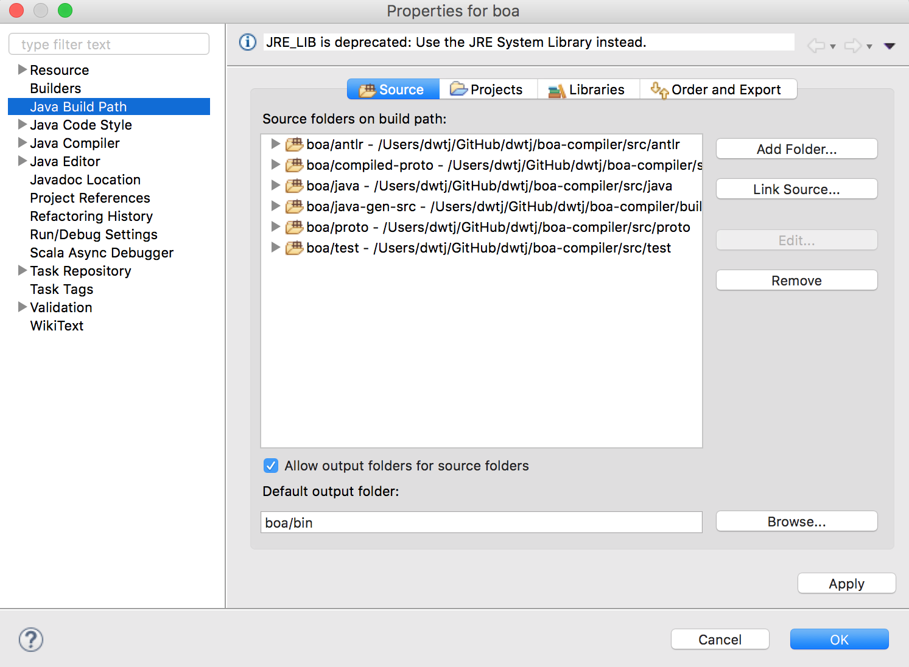
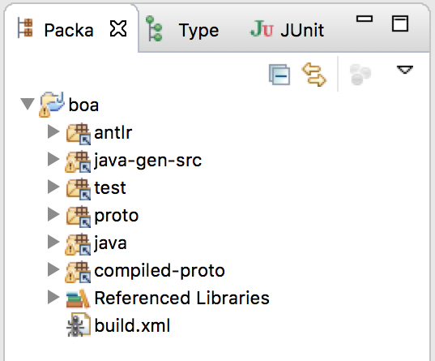
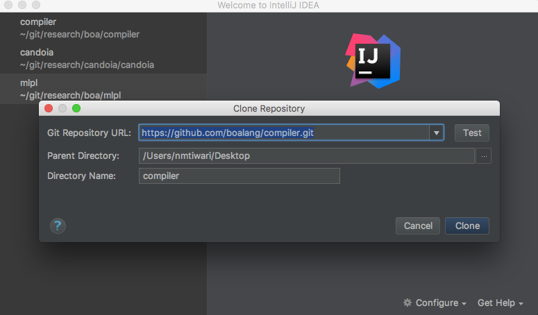
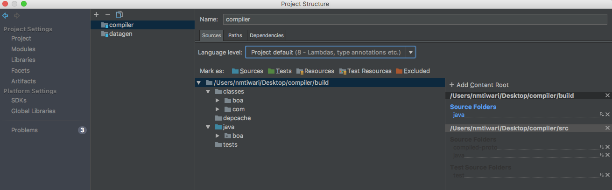
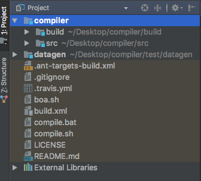

Development Setup
=================

This file describes how you might set up your development environment to view or edit the Boa compiler's source code.

Set Up Eclipse Development From a Git Repository
------------------------------------------------

Below we describe how to create an Eclipse project, stored on your file system within your Eclipse workspace. This project is linked to your local copy of the Git repository, stored (potentially) elsewhere on the filesystem.

Once we have performed this configuration, Eclipse will be able to perform the build, trigger `ant` targets, and to edit the project's source files.

1. Import the a local Git repo:
    - Select "File > Import".
    - Select "Git > Projects from Git".
    - Point Eclipse towards a repo with either "Existing local repository" or "Clone URI".
    - Select "Import using the New Project wizard", and click "Finish".

2. Make sure that the project has been cleaned with `ant clean`, and then manually add an empty `build/classes` directory to the repo. (For example, `cd` to the root of the repo, and run `ant clean; mkdir -p build/classes`).

3. Complete the import by creating a new Eclipse project:
    - Select "Java Project from Existing Ant Buildfile".
    - Browse to and select `build.xml` in the newly cloned directory.
    - You should now see a few "javac tasks".
    - **Important:** Check "Link to the buildfile in the file system".
    - From the root of the repo, run both `ant compile`.
    - Select "Finish".

4. Use a CLI to compile the project.
    - `cd` to the repo's root.
    - `ant compile`.

5. Make sure that the Eclipse project has linked to all the repo's source directories:
    - From the newly-created `boa` project's "Properties > Java Build Path", select the "Source" tab.
    - Use "Link Source..." until each of the directories under `src` (e.g. `src/java`, `src/test`, `src/compiled-proto`, etc.) has been added to the list of source directories.
    - Use "Link Source..." again to add `build/java` as a source folder. Note that because the name `java` has already been used in the Java project, you will need to name this source something else (e.g. `java-gen-src`). This doesn't mean renaming the directory on the file system, just giving it a different logical name within your Eclipse project.
    - After adding these directories, your "Source" tab should look something like this: 
    - Your package explorer should now look something like this: 

6. Configure `ant` as an external tool so that you can trigger parts of the build which Eclipse can't perform (e.g. `compile-protobuf` and `compile-parser`).
    - Enter "External Tools Configuration".
    - Select or create an "Ant Build" launch configuration on the left (e.g. `boa build.xml`).
    - Set its "Base Directory" to be the root of the Boa compiler's repository.
    - Click "Apply".

Set Up IntelliJ Development From a Git Repository
------------------------------------------------

Below we describe how to create an Eclipse project, stored on your file system within your IntelliJ environment. 
This 
project is linked to your remote copy of the Git.

Once we have performed this configuration, IntelliJ will be able to 
perform the build, trigger `ant` targets, and to edit 
the project's source files.



1. Import the a remote Git repo:

    - Select “Checkout from version control > Github”. This may prompt you to provide your Github username and password to access your account.
    
    - Provide “https://github.com/boalang/compiler.git” in the field for “Git Repository URL”.
    
    - Provide local path to clone the project.
    
    - After this step your clone repository window should look like: 	
    - Hit clone to start the cloning process.




2. Complete the import by selecting “next > next > next > Finish ”. You have imported the project successfully.
  

3. Use a CLI to compile the project. (You can also use “Terminal” available in the IDE itself.)
:
    - cd` to the repo's root.
    
    - ant`.    

4. Make sure that the IntelliJ project has linked to all the repo's source directories:

    - From the newly-created `boa` project's "Properties > Compiler”, select the "Source" tab.
    
    - Use “Add Content Root“ to add “build” directory located under root directory.
    
    - After adding “build” directory, your "Source" tab should look something like this: 
    
    - Your project sidebar should now look something like this:   
    	
    - Hit “OK”.
 

